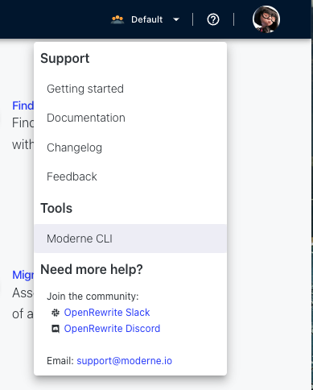

# Moderne CLI adventure

In this session we are going to use a free Moderne CLI that allows to 
run OpenRewrite recipes without requiring to configure any build plugins
and therefore support other programming languages and build tools that 
are not for Java developers. 

## Prepare your environment

- Download the CLI. To do so, download the CLI from `https://public.moderne.io`



- Create a Moderne Access Token from `https://public.moderne.io/settings/access-token`
and store it in your local file system.

echo "YOUR_ACCESS_TOKEN" > $HOME/.moderne/token.txt

- Clone the repository `https://github.com/spring-projects/spring-petclinic`

```
git clone https://github.com/spring-projects/spring-petclinic
```

- Checkout the last commit in Spring Boot 2.0
   
```
cd spring-petclinic
git checkout 9ecdc1111e3da388a750ace41a125287d9620534
```
- Test you can build it

```
./gradlew build -x test


## Run the CLI 

- Run the following command from the `spring-petclinic` repository

```
mod run --path . --recipeName org.openrewrite.java.spring.boot3.UpgradeSpringBoot_3_0 --recipeGAV org.openrewrite.recipe:rewrite-spring:4.36.0
```

- Apply the patch

The previous command should have printed a patch file in the standard output. To properly see the changes, let's apply them.

```
git apply REPLACE_FOR_PATCH_FILE 
```

and then, see the changes with:

```
git diff
```


