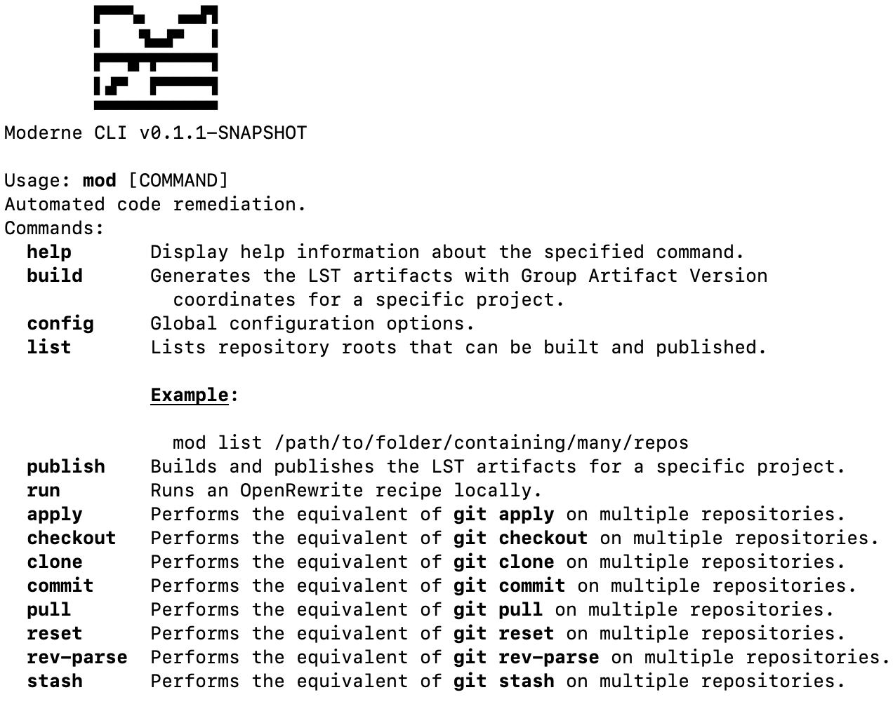

# Moderne CLI exercise

In this exercise, you will use the [Moderne CLI](https://docs.moderne.io/moderne-cli/cli-intro), a free tool that
allows developers to run OpenRewrite recipes without configuring any build plugin, to migrate a repository from Spring
Boot 2 to Spring Boot 3.

## Prepare your environment

### Download and configure the Moderne CLI

1. Go to the [Moderne platform](https://app.moderne.io) and sign in. If you don't have an account, you can sign up for
   free.

2. Download the CLI by clicking on this [link](https://drive.google.com/file/d/1kFvtV_13UPnsW1VtzUTDzd6R-Q6Um-vf/view?usp=drive_link)

3. Regardless of how you downloaded the CLI, you'll need to save it somewhere that your terminal can access. This could
   involve updating your `PATH` to point to a specific location or this could involve putting it in a directory that's
   already on your `PATH` such as a `/usr/bin` directory.

4. Ensure you can run the CLI by typing `mod help`. If everything is set up correctly, you should see a list of
   commands:

   

5. Before you can run any commands, you'll need to create a Moderne Access Token. Go
   to https://app.moderne.io/settings/access-token, enter a name for the token, and press `generate`.

6. Once created, you should see a command that you can run to install the token on your system.

   ```shell
   mod config moderne https://app.moderne.io --token mat-YOUR_TOKEN_HERE
   ```

7. Install recipes

```shell
  mod config recipes install --from-moderne
```

### Configure the Spring PetClinic repository

With the CLI downloaded and configured, you're now ready to set up the repository.

1. Clone the [Spring PetClinic
   repository](https://github.com/spring-projects/spring-petclinic):

   ```shell
   git clone https://github.com/spring-projects/spring-petclinic
   ```

2. Check out the last Spring Boot 2.0 commit:

   ```shell
   cd spring-petclinic
   git checkout b527de52f5fd19f9fe550372c017d145a3b2a809
   ```

3. If you tried building this repository right now, you would more than likely run into errors. This is because this
   version of the Spring PetClinic repo requires Java 8. To ensure that everything builds correctly, you may need to
   download Java 8 and update your `JAVA_HOME` environment variable. If you are on a Unix-based system, we recommend
   using [SDKMan](https://sdkman.io/):

   ```shell
   sdk install java VERSION_SDKMAN_JAVA8
   sdk use java VERSION_SDKMAN_JAVA8
   ```

   :::note
   If you want to use `sdk` and the `java VERSION_SDKMAN_JAVA8` distribution is not available for you, select any distribution
   that represents a Java 8 version.
   :::

   :::note
   If you aren't on a Unix-based system or you don't want to install SDKMan, you'll need to install Java 8 and run
   something like:

    ```shell
    export JAVA_HOME=REPLACE_FOR_LOCATION_OF_JAVA_8
    ```

   :::

4. With Java 8 configured, make sure that the Spring PetClinic repository builds on your machine:

   ```shell
   ./mvnw verify -DskipTests
   ```

5. If everything has been set up correctly, you should see a `BUILD SUCCESS` message after the project is built and the
   tests passed.

## Migrate to Spring Boot 3 using the Moderne CLI

Now that the repository is configured, it's time to migrate it to Spring Boot 3 using the Moderne CLI.

1. Run the build command to generate the LST for the PetClinic repo:

   ```shell
   mod build .
   ```

   <details>
   <summary>You should see output similar to the following.</summary>

   ```
       ▛▀▀▚▖  ▗▄▟▜
       ▌   ▜▄▟▀  ▐
       ▛▀▀█▀▛▀▀▀▀▜
       ▌▟▀  ▛▀▀▀▀▜
       ▀▀▀▀▀▀▀▀▀▀▀
   Moderne CLI v0.3.0

   > Selecting repositories

   > spring-projects/spring-petclinic@mainnic
   Selected 1 repositories (0.02s)
   
   > Building LST(s)
   
   > spring-projects/spring-petclinic@main
   Build output will be written to file://./.moderne/build/20230904223334-5kM1v/build.log
   
   🏗 Step 1 - build with Maven
   Selected a Java 8 JDK.
   
   🏗 Step 2 - build with Native
   ✅ Built LST file://./.moderne/build/20230904223334-5kM1v/spring-petclinic-20230904223403-ast.jar (28s)
   
   
   MOD SUCCEEDED in (28s)             .
   ```
   </details>

2Kick off the recipe by running the following command from the
`spring-petclinic` repository:

   ```shell
   mod run --recipeName org.openrewrite.java.spring.boot3.VERSION_RECIPE_SPRING_BOOT --recipeGAVs rewrite-spring --skipBuild
   ```

   <details>
   <summary>You should see output similar to the following.</summary>

   ```
       ▛▀▀▚▖  ▗▄▟▜
       ▌   ▜▄▟▀  ▐
       ▛▀▀█▀▛▀▀▀▀▜
       ▌▟▀  ▛▀▀▀▀▜
       ▀▀▀▀▀▀▀▀▀▀▀
   Moderne CLI v0.3.0

   > Selecting repositories
   
   > spring-projects/spring-petclinic@main
   Selected 1 repositories (0.03s)
   
   > Running recipe org.openrewrite.java.spring.boot3.VERSION_RECIPE_SPRING_BOOT
   
   > spring-projects/spring-petclinic@main
   No changes.
   Found results on 0 repositories (14m 56s)
   
   MOD SUCCEEDED in (14m 56s)   
   ```

   </details>

4. The previous command should have updated your source files. Whenever you run a recipe, you should always double-check
   that the changes made match your expectations by running:

   ```shell
   git diff
   ```

   <details>
   <summary>You should see output similar to the following.</summary>

   ```diff
   diff --git a/pom.xml b/pom.xml
   index 0b8f9c2..738ff94 100644
   --- a/pom.xml
   +++ b/pom.xml
   @@ -10,14 +10,14 @@
      <parent>
   	 <groupId>org.springframework.boot</groupId>
   	 <artifactId>spring-boot-starter-parent</artifactId>
   -    <version>2.0.0.RELEASE</version>
   +    <version>VERSION_SPRING_BOOT31</version>
      </parent>
      <name>petclinic</name>
    
      <properties>
    
   	 <!-- Generic properties -->
   -    <java.version>1.8</java.version>
   +    <java.version>17</java.version>
   	 <project.build.sourceEncoding>UTF-8</project.build.sourceEncoding>
   	 <project.reporting.outputEncoding>UTF-8</project.reporting.outputEncoding>
    
   @@ -25,7 +25,7 @@
   	 <webjars-bootstrap.version>3.3.6</webjars-bootstrap.version>
   	 <webjars-jquery-ui.version>1.11.4</webjars-jquery-ui.version>
   	 <webjars-jquery.version>2.2.4</webjars-jquery.version>
   -    <wro4j.version>1.8.0</wro4j.version>
   +    <wro4j.version>1.10.1</wro4j.version>
    
   	 <cobertura.version>2.7</cobertura.version>
    
   @@ -53,6 +53,10 @@
   	   <groupId>org.springframework.boot</groupId>
   	   <artifactId>spring-boot-starter-thymeleaf</artifactId>
   	 </dependency>
   +    <dependency>
   +      <groupId>org.springframework.boot</groupId>
   +      <artifactId>spring-boot-starter-validation</artifactId>
   +    </dependency>
   	 <dependency>
   	   <groupId>org.springframework.boot</groupId>
   	   <artifactId>spring-boot-starter-test</artifactId>
   @@ -66,8 +70,8 @@
   	   <scope>runtime</scope>
   	 </dependency>
   	 <dependency>
   -      <groupId>mysql</groupId>
   -      <artifactId>mysql-connector-java</artifactId>
   +      <groupId>com.mysql</groupId>
   +      <artifactId>mysql-connector-j</artifactId>
   	   <scope>runtime</scope>
   	 </dependency>
    
   @@ -79,6 +83,7 @@
   	 <dependency>
   	   <groupId>org.ehcache</groupId>
   	   <artifactId>ehcache</artifactId>
   +      <classifier>jakarta</classifier>
   	 </dependency>
    
   	 <!-- webjars -->
   @@ -133,22 +138,6 @@
   	       </execution>
   	     </executions>
   	   </plugin>
   -      <plugin>
   -        <groupId>org.codehaus.mojo</groupId>
   -        <artifactId>cobertura-maven-plugin</artifactId>
   -        <version>${cobertura.version}</version>
   -        <configuration>
   -          <check />
   -        </configuration>
   -        <executions>
   -          <execution>
   -            <goals>
   -              <goal>clean</goal>
   -              <goal>check</goal>
   -            </goals>
   -          </execution>
   -        </executions>
   -      </plugin>
    
   	   <!-- Spring Boot Actuator displays build-related information if a git.properties
   	     file is present at the classpath -->
   @@ -204,17 +193,6 @@
      <reporting>
   	 <plugins>
   	   <!-- integrate maven-cobertura-plugin to project site -->
   -      <plugin>
   -        <groupId>org.codehaus.mojo</groupId>
   -        <artifactId>cobertura-maven-plugin</artifactId>
   -        <version>${cobertura.version}</version>
   -        <configuration>
   -          <formats>
   -            <format>html</format>
   -          </formats>
   -          <check />
   -        </configuration>
   -      </plugin>
   	 </plugins>
      </reporting>
    
   diff --git a/src/main/java/org/springframework/samples/petclinic/model/BaseEntity.java b/src/main/java/org/springframework/samples/petclinic/model/BaseEntity.java
   index 86cc210..d45134c 100644
   --- a/src/main/java/org/springframework/samples/petclinic/model/BaseEntity.java
   +++ b/src/main/java/org/springframework/samples/petclinic/model/BaseEntity.java
   @@ -17,10 +17,10 @@ package org.springframework.samples.petclinic.model;
    
    import java.io.Serializable;
    
   -import javax.persistence.GeneratedValue;
   -import javax.persistence.GenerationType;
   -import javax.persistence.Id;
   -import javax.persistence.MappedSuperclass;
   +import jakarta.persistence.GeneratedValue;
   +import jakarta.persistence.GenerationType;
   +import jakarta.persistence.Id;
   +import jakarta.persistence.MappedSuperclass;
    
    /**
     * Simple JavaBean domain object with an id property. Used as a base class for objects
   diff --git a/src/main/java/org/springframework/samples/petclinic/model/NamedEntity.java b/src/main/java/org/springframework/samples/petclinic/model/NamedEntity.java
   index d66c97a..83bb717 100644
   --- a/src/main/java/org/springframework/samples/petclinic/model/NamedEntity.java
   +++ b/src/main/java/org/springframework/samples/petclinic/model/NamedEntity.java
   @@ -15,8 +15,8 @@
     */
    package org.springframework.samples.petclinic.model;
    
   -import javax.persistence.Column;
   -import javax.persistence.MappedSuperclass;
   +import jakarta.persistence.Column;
   +import jakarta.persistence.MappedSuperclass;
    
    
    /**
   diff --git a/src/main/java/org/springframework/samples/petclinic/model/Person.java b/src/main/java/org/springframework/samples/petclinic/model/Person.java
   index 5d23523..7294998 100644
   --- a/src/main/java/org/springframework/samples/petclinic/model/Person.java
   +++ b/src/main/java/org/springframework/samples/petclinic/model/Person.java
   @@ -15,9 +15,9 @@
     */
    package org.springframework.samples.petclinic.model;
    
   -import javax.persistence.Column;
   -import javax.persistence.MappedSuperclass;
   -import javax.validation.constraints.NotEmpty;
   +import jakarta.persistence.Column;
   +import jakarta.persistence.MappedSuperclass;
   +import jakarta.validation.constraints.NotEmpty;
    
    /**
     * Simple JavaBean domain object representing an person.
   diff --git a/src/main/java/org/springframework/samples/petclinic/owner/Owner.java b/src/main/java/org/springframework/samples/petclinic/owner/Owner.java
   index 89aad2c..063c750 100644
   --- a/src/main/java/org/springframework/samples/petclinic/owner/Owner.java
   +++ b/src/main/java/org/springframework/samples/petclinic/owner/Owner.java
   @@ -21,13 +21,13 @@ import java.util.HashSet;
    import java.util.List;
    import java.util.Set;
    
   -import javax.persistence.CascadeType;
   -import javax.persistence.Column;
   -import javax.persistence.Entity;
   -import javax.persistence.OneToMany;
   -import javax.persistence.Table;
   -import javax.validation.constraints.Digits;
   -import javax.validation.constraints.NotEmpty;
   +import jakarta.persistence.CascadeType;
   +import jakarta.persistence.Column;
   +import jakarta.persistence.Entity;
   +import jakarta.persistence.OneToMany;
   +import jakarta.persistence.Table;
   +import jakarta.validation.constraints.Digits;
   +import jakarta.validation.constraints.NotEmpty;
    
    import org.springframework.beans.support.MutableSortDefinition;
    import org.springframework.beans.support.PropertyComparator;
   diff --git a/src/main/java/org/springframework/samples/petclinic/owner/OwnerController.java b/src/main/java/org/springframework/samples/petclinic/owner/OwnerController.java
   index d914ed7..a25870b 100644
   --- a/src/main/java/org/springframework/samples/petclinic/owner/OwnerController.java
   +++ b/src/main/java/org/springframework/samples/petclinic/owner/OwnerController.java
   @@ -15,7 +15,6 @@
     */
    package org.springframework.samples.petclinic.owner;
    
   -import org.springframework.beans.factory.annotation.Autowired;
    import org.springframework.stereotype.Controller;
    import org.springframework.ui.Model;
    import org.springframework.validation.BindingResult;
   @@ -26,7 +25,7 @@ import org.springframework.web.bind.annotation.PathVariable;
    import org.springframework.web.bind.annotation.PostMapping;
    import org.springframework.web.servlet.ModelAndView;
    
   -import javax.validation.Valid;
   +import jakarta.validation.Valid;
    import java.util.Collection;
    import java.util.Map;
    
   @@ -43,7 +42,6 @@ class OwnerController {
   	 private final OwnerRepository owners;
    
    
   -    @Autowired
   	 public OwnerController(OwnerRepository clinicService) {
   	     this.owners = clinicService;
   	 }
   @@ -102,14 +100,14 @@ class OwnerController {
   	 }
    
   	 @GetMapping("/owners/{ownerId}/edit")
   -    public String initUpdateOwnerForm(@PathVariable("ownerId") int ownerId, Model model) {
   +    public String initUpdateOwnerForm(@PathVariable int ownerId, Model model) {
   	     Owner owner = this.owners.findById(ownerId);
   	     model.addAttribute(owner);
   	     return VIEWS_OWNER_CREATE_OR_UPDATE_FORM;
   	 }
    
   	 @PostMapping("/owners/{ownerId}/edit")
   -    public String processUpdateOwnerForm(@Valid Owner owner, BindingResult result, @PathVariable("ownerId") int ownerId) {
   +    public String processUpdateOwnerForm(@Valid Owner owner, BindingResult result, @PathVariable int ownerId) {
   	     if (result.hasErrors()) {
   	         return VIEWS_OWNER_CREATE_OR_UPDATE_FORM;
   	     } else {
   @@ -126,7 +124,7 @@ class OwnerController {
   	  * @return a ModelMap with the model attributes for the view
   	  */
   	 @GetMapping("/owners/{ownerId}")
   -    public ModelAndView showOwner(@PathVariable("ownerId") int ownerId) {
   +    public ModelAndView showOwner(@PathVariable int ownerId) {
   	     ModelAndView mav = new ModelAndView("owners/ownerDetails");
   	     mav.addObject(this.owners.findById(ownerId));
   	     return mav;
   diff --git a/src/main/java/org/springframework/samples/petclinic/owner/Pet.java b/src/main/java/org/springframework/samples/petclinic/owner/Pet.java
   index 5e226a1..106934b 100755
   --- a/src/main/java/org/springframework/samples/petclinic/owner/Pet.java
   +++ b/src/main/java/org/springframework/samples/petclinic/owner/Pet.java
   @@ -23,16 +23,16 @@ import java.util.LinkedHashSet;
    import java.util.List;
    import java.util.Set;
    
   -import javax.persistence.CascadeType;
   -import javax.persistence.Column;
   -import javax.persistence.Entity;
   -import javax.persistence.FetchType;
   -import javax.persistence.JoinColumn;
   -import javax.persistence.ManyToOne;
   -import javax.persistence.OneToMany;
   -import javax.persistence.Table;
   -import javax.persistence.Temporal;
   -import javax.persistence.TemporalType;
   +import jakarta.persistence.CascadeType;
   +import jakarta.persistence.Column;
   +import jakarta.persistence.Entity;
   +import jakarta.persistence.FetchType;
   +import jakarta.persistence.JoinColumn;
   +import jakarta.persistence.ManyToOne;
   +import jakarta.persistence.OneToMany;
   +import jakarta.persistence.Table;
   +import jakarta.persistence.Temporal;
   +import jakarta.persistence.TemporalType;
    
    import org.springframework.beans.support.MutableSortDefinition;
    import org.springframework.beans.support.PropertyComparator;
   diff --git a/src/main/java/org/springframework/samples/petclinic/owner/PetController.java b/src/main/java/org/springframework/samples/petclinic/owner/PetController.java
   index 9c52e03..8694be1 100644
   --- a/src/main/java/org/springframework/samples/petclinic/owner/PetController.java
   +++ b/src/main/java/org/springframework/samples/petclinic/owner/PetController.java
   @@ -15,7 +15,6 @@
     */
    package org.springframework.samples.petclinic.owner;
    
   -import org.springframework.beans.factory.annotation.Autowired;
    import org.springframework.stereotype.Controller;
    import org.springframework.ui.ModelMap;
    import org.springframework.util.StringUtils;
   @@ -23,7 +22,7 @@ import org.springframework.validation.BindingResult;
    import org.springframework.web.bind.WebDataBinder;
    import org.springframework.web.bind.annotation.*;
    
   -import javax.validation.Valid;
   +import jakarta.validation.Valid;
    import java.util.Collection;
    
    /**
   @@ -39,7 +38,6 @@ class PetController {
   	 private final PetRepository pets;
   	 private final OwnerRepository owners;
    
   -    @Autowired
   	 public PetController(PetRepository pets, OwnerRepository owners) {
   	     this.pets = pets;
   	     this.owners = owners;
   @@ -51,7 +49,7 @@ class PetController {
   	 }
    
   	 @ModelAttribute("owner")
   -    public Owner findOwner(@PathVariable("ownerId") int ownerId) {
   +    public Owner findOwner(@PathVariable int ownerId) {
   	     return this.owners.findById(ownerId);
   	 }
    
   @@ -89,7 +87,7 @@ class PetController {
   	 }
    
   	 @GetMapping("/pets/{petId}/edit")
   -    public String initUpdateForm(@PathVariable("petId") int petId, ModelMap model) {
   +    public String initUpdateForm(@PathVariable int petId, ModelMap model) {
   	     Pet pet = this.pets.findById(petId);
   	     model.put("pet", pet);
   	     return VIEWS_PETS_CREATE_OR_UPDATE_FORM;
   diff --git a/src/main/java/org/springframework/samples/petclinic/owner/PetType.java b/src/main/java/org/springframework/samples/petclinic/owner/PetType.java
   index ac827b3..e6a7271 100644
   --- a/src/main/java/org/springframework/samples/petclinic/owner/PetType.java
   +++ b/src/main/java/org/springframework/samples/petclinic/owner/PetType.java
   @@ -15,8 +15,8 @@
     */
    package org.springframework.samples.petclinic.owner;
    
   -import javax.persistence.Entity;
   -import javax.persistence.Table;
   +import jakarta.persistence.Entity;
   +import jakarta.persistence.Table;
    
    import org.springframework.samples.petclinic.model.NamedEntity;
    
   diff --git a/src/main/java/org/springframework/samples/petclinic/owner/PetTypeFormatter.java b/src/main/java/org/springframework/samples/petclinic/owner/PetTypeFormatter.java
   index 78451ca..8ad364f 100644
   --- a/src/main/java/org/springframework/samples/petclinic/owner/PetTypeFormatter.java
   +++ b/src/main/java/org/springframework/samples/petclinic/owner/PetTypeFormatter.java
   @@ -20,7 +20,6 @@ import java.text.ParseException;
    import java.util.Collection;
    import java.util.Locale;
    
   -import org.springframework.beans.factory.annotation.Autowired;
    import org.springframework.format.Formatter;
    import org.springframework.stereotype.Component;
    
   @@ -41,7 +40,6 @@ public class PetTypeFormatter implements Formatter<PetType> {
   	 private final PetRepository pets;
    
    
   -    @Autowired
   	 public PetTypeFormatter(PetRepository pets) {
   	     this.pets = pets;
   	 }
   diff --git a/src/main/java/org/springframework/samples/petclinic/owner/VisitController.java b/src/main/java/org/springframework/samples/petclinic/owner/VisitController.java
   index d7afed1..c7e6109 100644
   --- a/src/main/java/org/springframework/samples/petclinic/owner/VisitController.java
   +++ b/src/main/java/org/springframework/samples/petclinic/owner/VisitController.java
   @@ -15,7 +15,6 @@
     */
    package org.springframework.samples.petclinic.owner;
    
   -import org.springframework.beans.factory.annotation.Autowired;
    import org.springframework.samples.petclinic.visit.Visit;
    import org.springframework.samples.petclinic.visit.VisitRepository;
    import org.springframework.stereotype.Controller;
   @@ -23,7 +22,7 @@ import org.springframework.validation.BindingResult;
    import org.springframework.web.bind.WebDataBinder;
    import org.springframework.web.bind.annotation.*;
    
   -import javax.validation.Valid;
   +import jakarta.validation.Valid;
    import java.util.Map;
    
    /**
   @@ -40,7 +39,6 @@ class VisitController {
   	 private final PetRepository pets;
    
    
   -    @Autowired
   	 public VisitController(VisitRepository visits, PetRepository pets) {
   	     this.visits = visits;
   	     this.pets = pets;
   @@ -62,7 +60,7 @@ class VisitController {
   	  * @return Pet
   	  */
   	 @ModelAttribute("visit")
   -    public Visit loadPetWithVisit(@PathVariable("petId") int petId, Map<String, Object> model) {
   +    public Visit loadPetWithVisit(@PathVariable int petId, Map<String, Object> model) {
   	     Pet pet = this.pets.findById(petId);
   	     model.put("pet", pet);
   	     Visit visit = new Visit();
   @@ -72,7 +70,7 @@ class VisitController {
    
   	 // Spring MVC calls method loadPetWithVisit(...) before initNewVisitForm is called
   	 @GetMapping("/owners/*/pets/{petId}/visits/new")
   -    public String initNewVisitForm(@PathVariable("petId") int petId, Map<String, Object> model) {
   +    public String initNewVisitForm(@PathVariable int petId, Map<String, Object> model) {
   	     return "pets/createOrUpdateVisitForm";
   	 }
    
   diff --git a/src/main/java/org/springframework/samples/petclinic/system/CrashController.java b/src/main/java/org/springframework/samples/petclinic/system/CrashController.java
   index 2f5e7a3..29f4fd5 100644
   --- a/src/main/java/org/springframework/samples/petclinic/system/CrashController.java
   +++ b/src/main/java/org/springframework/samples/petclinic/system/CrashController.java
   @@ -30,8 +30,10 @@ class CrashController {
    
   	 @GetMapping("/oups")
   	 public String triggerException() {
   -        throw new RuntimeException("Expected: controller used to showcase what "
   -                + "happens when an exception is thrown");
   +        throw new RuntimeException("""
   +                Expected: controller used to showcase what \
   +                happens when an exception is thrown\
   +                """);
   	 }
    
    }
   diff --git a/src/main/java/org/springframework/samples/petclinic/vet/Specialty.java b/src/main/java/org/springframework/samples/petclinic/vet/Specialty.java
   index 5691c24..7727e21 100644
   --- a/src/main/java/org/springframework/samples/petclinic/vet/Specialty.java
   +++ b/src/main/java/org/springframework/samples/petclinic/vet/Specialty.java
   @@ -17,8 +17,8 @@ package org.springframework.samples.petclinic.vet;
    
    import java.io.Serializable;
    
   -import javax.persistence.Entity;
   -import javax.persistence.Table;
   +import jakarta.persistence.Entity;
   +import jakarta.persistence.Table;
    
    import org.springframework.samples.petclinic.model.NamedEntity;
    
   diff --git a/src/main/java/org/springframework/samples/petclinic/vet/Vet.java b/src/main/java/org/springframework/samples/petclinic/vet/Vet.java
   index 43aecc4..d2841dd 100644
   --- a/src/main/java/org/springframework/samples/petclinic/vet/Vet.java
   +++ b/src/main/java/org/springframework/samples/petclinic/vet/Vet.java
   @@ -21,13 +21,13 @@ import java.util.HashSet;
    import java.util.List;
    import java.util.Set;
    
   -import javax.persistence.Entity;
   -import javax.persistence.FetchType;
   -import javax.persistence.JoinColumn;
   -import javax.persistence.JoinTable;
   -import javax.persistence.ManyToMany;
   -import javax.persistence.Table;
   -import javax.xml.bind.annotation.XmlElement;
   +import jakarta.persistence.Entity;
   +import jakarta.persistence.FetchType;
   +import jakarta.persistence.JoinColumn;
   +import jakarta.persistence.JoinTable;
   +import jakarta.persistence.ManyToMany;
   +import jakarta.persistence.Table;
   +import jakarta.xml.bind.annotation.XmlElement;
    
    import org.springframework.beans.support.MutableSortDefinition;
    import org.springframework.beans.support.PropertyComparator;
   diff --git a/src/main/java/org/springframework/samples/petclinic/vet/VetController.java b/src/main/java/org/springframework/samples/petclinic/vet/VetController.java
   index 7ce8374..ddaa364 100644
   --- a/src/main/java/org/springframework/samples/petclinic/vet/VetController.java
   +++ b/src/main/java/org/springframework/samples/petclinic/vet/VetController.java
   @@ -15,7 +15,6 @@
     */
    package org.springframework.samples.petclinic.vet;
    
   -import org.springframework.beans.factory.annotation.Autowired;
    import org.springframework.stereotype.Controller;
    import org.springframework.web.bind.annotation.GetMapping;
    import org.springframework.web.bind.annotation.ResponseBody;
   @@ -33,7 +32,6 @@ class VetController {
    
   	 private final VetRepository vets;
    
   -    @Autowired
   	 public VetController(VetRepository clinicService) {
   	     this.vets = clinicService;
   	 }
   diff --git a/src/main/java/org/springframework/samples/petclinic/vet/Vets.java b/src/main/java/org/springframework/samples/petclinic/vet/Vets.java
   index f5b24c3..c90b652 100644
   --- a/src/main/java/org/springframework/samples/petclinic/vet/Vets.java
   +++ b/src/main/java/org/springframework/samples/petclinic/vet/Vets.java
   @@ -18,8 +18,8 @@ package org.springframework.samples.petclinic.vet;
    import java.util.ArrayList;
    import java.util.List;
    
   -import javax.xml.bind.annotation.XmlElement;
   -import javax.xml.bind.annotation.XmlRootElement;
   +import jakarta.xml.bind.annotation.XmlElement;
   +import jakarta.xml.bind.annotation.XmlRootElement;
    
    /**
     * Simple domain object representing a list of veterinarians. Mostly here to be used for the 'vets' {@link
   diff --git a/src/main/java/org/springframework/samples/petclinic/visit/Visit.java b/src/main/java/org/springframework/samples/petclinic/visit/Visit.java
   index ce10d7b..2a5e854 100755
   --- a/src/main/java/org/springframework/samples/petclinic/visit/Visit.java
   +++ b/src/main/java/org/springframework/samples/petclinic/visit/Visit.java
   @@ -17,12 +17,12 @@ package org.springframework.samples.petclinic.visit;
    
    import java.util.Date;
    
   -import javax.persistence.Column;
   -import javax.persistence.Entity;
   -import javax.persistence.Table;
   -import javax.persistence.Temporal;
   -import javax.persistence.TemporalType;
   -import javax.validation.constraints.NotEmpty;
   +import jakarta.persistence.Column;
   +import jakarta.persistence.Entity;
   +import jakarta.persistence.Table;
   +import jakarta.persistence.Temporal;
   +import jakarta.persistence.TemporalType;
   +import jakarta.validation.constraints.NotEmpty;
    
    import org.springframework.format.annotation.DateTimeFormat;
    import org.springframework.samples.petclinic.model.BaseEntity;
   diff --git a/src/main/resources/application.properties b/src/main/resources/application.properties
   index c8d5a5c..0616806 100644
   --- a/src/main/resources/application.properties
   +++ b/src/main/resources/application.properties
   @@ -1,7 +1,7 @@
    # database init, supports mysql too
    database=hsqldb
   -spring.datasource.schema=classpath*:db/${database}/schema.sql
   -spring.datasource.data=classpath*:db/${database}/data.sql
   +spring.sql.init.schema-locations=classpath*:db/${database}/schema.sql
   +spring.sql.init.data-locations=classpath*:db/${database}/data.sql
    
    # Web
    spring.thymeleaf.mode=HTML
   diff --git a/src/test/java/org/springframework/samples/petclinic/model/ValidatorTests.java b/src/test/java/org/springframework/samples/petclinic/model/ValidatorTests.java
   index 7da0d3d..cfafd31 100644
   --- a/src/test/java/org/springframework/samples/petclinic/model/ValidatorTests.java
   +++ b/src/test/java/org/springframework/samples/petclinic/model/ValidatorTests.java
   @@ -3,8 +3,8 @@ package org.springframework.samples.petclinic.model;
    import java.util.Locale;
    import java.util.Set;
    
   -import javax.validation.ConstraintViolation;
   -import javax.validation.Validator;
   +import jakarta.validation.ConstraintViolation;
   +import jakarta.validation.Validator;
    
    import org.junit.Test;
    
   diff --git a/src/test/java/org/springframework/samples/petclinic/owner/OwnerControllerTests.java b/src/test/java/org/springframework/samples/petclinic/owner/OwnerControllerTests.java
   index 7fccb3b..7b2edef 100644
   --- a/src/test/java/org/springframework/samples/petclinic/owner/OwnerControllerTests.java
   +++ b/src/test/java/org/springframework/samples/petclinic/owner/OwnerControllerTests.java
   @@ -12,14 +12,12 @@ import static org.springframework.test.web.servlet.result.MockMvcResultMatchers.
    import org.assertj.core.util.Lists;
    import org.junit.Before;
    import org.junit.Test;
   -import org.junit.runner.RunWith;
    import org.springframework.beans.factory.annotation.Autowired;
    import org.springframework.boot.test.autoconfigure.web.servlet.WebMvcTest;
    import org.springframework.boot.test.mock.mockito.MockBean;
    import org.springframework.samples.petclinic.owner.Owner;
    import org.springframework.samples.petclinic.owner.OwnerController;
    import org.springframework.samples.petclinic.owner.OwnerRepository;
   -import org.springframework.test.context.junit4.SpringRunner;
    import org.springframework.test.web.servlet.MockMvc;
    
    /**
   @@ -27,7 +25,6 @@ import org.springframework.test.web.servlet.MockMvc;
     *
     * @author Colin But
     */
   -@RunWith(SpringRunner.class)
    @WebMvcTest(OwnerController.class)
    public class OwnerControllerTests {
    
   diff --git a/src/test/java/org/springframework/samples/petclinic/owner/PetControllerTests.java b/src/test/java/org/springframework/samples/petclinic/owner/PetControllerTests.java
   index f95d7c8..19ea9c1 100755
   --- a/src/test/java/org/springframework/samples/petclinic/owner/PetControllerTests.java
   +++ b/src/test/java/org/springframework/samples/petclinic/owner/PetControllerTests.java
   @@ -10,7 +10,6 @@ import static org.springframework.test.web.servlet.result.MockMvcResultMatchers.
    import org.assertj.core.util.Lists;
    import org.junit.Before;
    import org.junit.Test;
   -import org.junit.runner.RunWith;
    import org.springframework.beans.factory.annotation.Autowired;
    import org.springframework.boot.test.autoconfigure.web.servlet.WebMvcTest;
    import org.springframework.boot.test.mock.mockito.MockBean;
   @@ -23,7 +22,6 @@ import org.springframework.samples.petclinic.owner.PetController;
    import org.springframework.samples.petclinic.owner.PetRepository;
    import org.springframework.samples.petclinic.owner.PetType;
    import org.springframework.samples.petclinic.owner.PetTypeFormatter;
   -import org.springframework.test.context.junit4.SpringRunner;
    import org.springframework.test.web.servlet.MockMvc;
    
    /**
   @@ -31,7 +29,6 @@ import org.springframework.test.web.servlet.MockMvc;
     *
     * @author Colin But
     */
   -@RunWith(SpringRunner.class)
    @WebMvcTest(value = PetController.class,
   	 includeFilters = @ComponentScan.Filter(
   	                         value = PetTypeFormatter.class,
   diff --git a/src/test/java/org/springframework/samples/petclinic/owner/PetTypeFormatterTests.java b/src/test/java/org/springframework/samples/petclinic/owner/PetTypeFormatterTests.java
   index 4e8e36c..387f918 100644
   --- a/src/test/java/org/springframework/samples/petclinic/owner/PetTypeFormatterTests.java
   +++ b/src/test/java/org/springframework/samples/petclinic/owner/PetTypeFormatterTests.java
   @@ -7,20 +7,20 @@ import java.util.List;
    import java.util.Locale;
    
    import org.junit.Before;
   +
   +import static org.junit.jupiter.api.Assertions.assertEquals;
    import org.junit.Test;
   -import org.junit.runner.RunWith;
   +import org.junit.jupiter.api.extension.ExtendWith;
    import org.mockito.Mock;
    import org.mockito.Mockito;
   -import org.mockito.junit.MockitoJUnitRunner;
   -
   -import static org.junit.Assert.assertEquals;
   +import org.mockito.junit.jupiter.MockitoExtension;
    
    /**
     * Test class for {@link PetTypeFormatter}
     *
     * @author Colin But
     */
   -@RunWith(MockitoJUnitRunner.class)
   +@ExtendWith(MockitoExtension.class)
    public class PetTypeFormatterTests {
    
   	 @Mock
   diff --git a/src/test/java/org/springframework/samples/petclinic/owner/VisitControllerTests.java b/src/test/java/org/springframework/samples/petclinic/owner/VisitControllerTests.java
   index 08d6136..f77c9a7 100644
   --- a/src/test/java/org/springframework/samples/petclinic/owner/VisitControllerTests.java
   +++ b/src/test/java/org/springframework/samples/petclinic/owner/VisitControllerTests.java
   @@ -9,7 +9,6 @@ import static org.springframework.test.web.servlet.result.MockMvcResultMatchers.
    
    import org.junit.Before;
    import org.junit.Test;
   -import org.junit.runner.RunWith;
    import org.springframework.beans.factory.annotation.Autowired;
    import org.springframework.boot.test.autoconfigure.web.servlet.WebMvcTest;
    import org.springframework.boot.test.mock.mockito.MockBean;
   @@ -17,7 +16,6 @@ import org.springframework.samples.petclinic.owner.Pet;
    import org.springframework.samples.petclinic.owner.PetRepository;
    import org.springframework.samples.petclinic.owner.VisitController;
    import org.springframework.samples.petclinic.visit.VisitRepository;
   -import org.springframework.test.context.junit4.SpringRunner;
    import org.springframework.test.web.servlet.MockMvc;
    
    /**
   @@ -25,7 +23,6 @@ import org.springframework.test.web.servlet.MockMvc;
     *
     * @author Colin But
     */
   -@RunWith(SpringRunner.class)
    @WebMvcTest(VisitController.class)
    public class VisitControllerTests {
    
   diff --git a/src/test/java/org/springframework/samples/petclinic/service/ClinicServiceTests.java b/src/test/java/org/springframework/samples/petclinic/service/ClinicServiceTests.java
   index 7ed5bf8..276ed65 100644
   --- a/src/test/java/org/springframework/samples/petclinic/service/ClinicServiceTests.java
   +++ b/src/test/java/org/springframework/samples/petclinic/service/ClinicServiceTests.java
   @@ -6,7 +6,6 @@ import java.util.Collection;
    import java.util.Date;
    
    import org.junit.Test;
   -import org.junit.runner.RunWith;
    import org.springframework.beans.factory.annotation.Autowired;
    import org.springframework.boot.test.autoconfigure.orm.jpa.DataJpaTest;
    import org.springframework.context.annotation.ComponentScan;
   @@ -20,7 +19,6 @@ import org.springframework.samples.petclinic.vet.VetRepository;
    import org.springframework.samples.petclinic.visit.Visit;
    import org.springframework.samples.petclinic.visit.VisitRepository;
    import org.springframework.stereotype.Service;
   -import org.springframework.test.context.junit4.SpringRunner;
    import org.springframework.transaction.annotation.Transactional;
    
    /**
   @@ -44,7 +42,6 @@ import org.springframework.transaction.annotation.Transactional;
     * @author Dave Syer
     */
    
   -@RunWith(SpringRunner.class)
    @DataJpaTest(includeFilters = @ComponentScan.Filter(Service.class))
    public class ClinicServiceTests {
    
   diff --git a/src/test/java/org/springframework/samples/petclinic/system/CrashControllerTests.java b/src/test/java/org/springframework/samples/petclinic/system/CrashControllerTests.java
   index 3f108bf..27701e9 100644
   --- a/src/test/java/org/springframework/samples/petclinic/system/CrashControllerTests.java
   +++ b/src/test/java/org/springframework/samples/petclinic/system/CrashControllerTests.java
   @@ -2,11 +2,9 @@ package org.springframework.samples.petclinic.system;
    
    import org.junit.Ignore;
    import org.junit.Test;
   -import org.junit.runner.RunWith;
    
    import org.springframework.beans.factory.annotation.Autowired;
    import org.springframework.boot.test.autoconfigure.web.servlet.WebMvcTest;
   -import org.springframework.test.context.junit4.SpringRunner;
    import org.springframework.test.web.servlet.MockMvc;
    
    import static org.springframework.test.web.servlet.request.MockMvcRequestBuilders.get;
   @@ -20,8 +18,6 @@ import static org.springframework.test.web.servlet.result.MockMvcResultMatchers.
     *
     * @author Colin But
     */
   -@RunWith(SpringRunner.class)
   -// Waiting https://github.com/spring-projects/spring-boot/issues/5574
    @Ignore
    @WebMvcTest(controllers = CrashController.class)
    public class CrashControllerTests {
   diff --git a/src/test/java/org/springframework/samples/petclinic/system/ProductionConfigurationTests.java b/src/test/java/org/springframework/samples/petclinic/system/ProductionConfigurationTests.java
   index 9636e36..026635f 100644
   --- a/src/test/java/org/springframework/samples/petclinic/system/ProductionConfigurationTests.java
   +++ b/src/test/java/org/springframework/samples/petclinic/system/ProductionConfigurationTests.java
   @@ -1,14 +1,11 @@
    package org.springframework.samples.petclinic.system;
    
    import org.junit.Test;
   -import org.junit.runner.RunWith;
    
    import org.springframework.beans.factory.annotation.Autowired;
    import org.springframework.boot.test.context.SpringBootTest;
    import org.springframework.samples.petclinic.vet.VetRepository;
   -import org.springframework.test.context.junit4.SpringRunner;
    
   -@RunWith(SpringRunner.class)
    @SpringBootTest
    public class ProductionConfigurationTests {
    
   diff --git a/src/test/java/org/springframework/samples/petclinic/vet/VetControllerTests.java b/src/test/java/org/springframework/samples/petclinic/vet/VetControllerTests.java
   index ce6adf8..0464dcb 100644
   --- a/src/test/java/org/springframework/samples/petclinic/vet/VetControllerTests.java
   +++ b/src/test/java/org/springframework/samples/petclinic/vet/VetControllerTests.java
   @@ -12,7 +12,6 @@ import static org.springframework.test.web.servlet.result.MockMvcResultMatchers.
    import org.assertj.core.util.Lists;
    import org.junit.Before;
    import org.junit.Test;
   -import org.junit.runner.RunWith;
    import org.springframework.beans.factory.annotation.Autowired;
    import org.springframework.boot.test.autoconfigure.web.servlet.WebMvcTest;
    import org.springframework.boot.test.mock.mockito.MockBean;
   @@ -21,14 +20,12 @@ import org.springframework.samples.petclinic.vet.Specialty;
    import org.springframework.samples.petclinic.vet.Vet;
    import org.springframework.samples.petclinic.vet.VetController;
    import org.springframework.samples.petclinic.vet.VetRepository;
   -import org.springframework.test.context.junit4.SpringRunner;
    import org.springframework.test.web.servlet.MockMvc;
    import org.springframework.test.web.servlet.ResultActions;
    
    /**
     * Test class for the {@link VetController}
     */
   -@RunWith(SpringRunner.class)
    @WebMvcTest(VetController.class)
    public class VetControllerTests {
   ```
   </details>

   If you look at the results you should see that:

    * The `@Autowired` annotation was removed
    * JUnit 4 has been replaced with JUnit 5
    * `javax` has been replaced with `jakarta`
    * The code has been migrated to Java 17 and text blocks are used
    * Some best practices are applied (such as adding the `public` test method modifier)

   Now unfortunately, the build is broken, as the commit we started from is using Wro4j, which has
   some [slight dependency conflicts](https://github.com/wro4j/wro4j/issues/1129).
   We've decided not to cover Wro4j with recipes for now,
   as [Spring Petclinic has dropped Wro4J](https://github.com/spring-projects/spring-petclinic/pull/868) as well.

## Run a recipe on multiple local repositories

In the previous example, we used the Moderne CLI to run a recipe against a repository on your local machine. This is
fine when you only have one repository you're working with. However, what if you wanted to run a recipe against many
repositories at once? Checking them out locally, building each of them, and then running a separate run command for each
would take a considerable amount of time.

Fortunately, the run command can be extended so that you can run recipes against multiple repositories that have already
published their [Lossless Semantic Tree](https://docs.moderne.io/concepts/lossless-semantic-trees) (LST) artifacts.

This can be especially helpful when you're working on debugging a new recipe and want to test it against many
repositories at once.

For this exercise, we have prepared a list of Spring 2.x real open source repositories from the `spring-projects` 
GitHub organization that can be migrated. They are registered in the Moderne platform in the `Spring Projects 2.x` 
organization. You can clone those repositories locally with the following steps:

```shell
mkdir -p $HOME/workshop
mod clone $HOME/workshop --moderne-organization "Spring Projects 2.x"
```

Then you should be able to see 3 different repositories in the `$HOME/workshop/spring-projects`,  directory:

```shell
ls -ltr $HOME/workshop/spring-projects/
```

<details>
<summary>You should see output similar to the following.</summary>

```
total 0
drwxr-xr-x  22 raquel  staff  704  5 sep 01:44 spring-hateoas-examples
drwxr-xr-x  15 raquel  staff  480  5 sep 01:44 spring-session-data-mongodb-examples
drwxr-xr-x  17 raquel  staff  544  5 sep 10:49 spring-data-release
```
</details>

Now that you have the repositories locally, you can run a recipe against all of them at once. Since all of 
these repositories have their LSTs published onto the Moderne platform, the build operation will download the
LSTs without having to build the repositories locally. This will save you a lot of time!

```shell
mod build $HOME/workshop
```

<details>
<summary>You should see output similar to the following.</summary>

```
        ▛▀▀▚▖  ▗▄▟▜
        ▌   ▜▄▟▀  ▐
        ▛▀▀█▀▛▀▀▀▀▜
        ▌▟▀  ▛▀▀▀▀▜
        ▀▀▀▀▀▀▀▀▀▀▀
Moderne CLI v0.1.1-SNAPSHOT

> Selecting repositories

> spring-projects/spring-data-release@mainp/spring-projects/spring-hateoas-examples
> spring-projects/spring-hateoas-examples@mainring-projects/spring-hateoas-examples
> spring-projects/spring-session-data-mongodb-examples@main/spring-hateoas-examples
Selected 3 repositories (0.45s)

> Building LST(s)

> spring-projects/spring-data-release@main
Build output will be written to file:///Users/raquel/workshop/spring-projects/spring-data-release/.moderne/build/20230905113522-rGwH8/build.log

🏗 Step 1 - download from Moderne         
✅ Downloaded LST file:///Users/raquel/workshop/spring-projects/spring-data-release/.moderne/build/20230905113522-rGwH8/0-spring-data-release-20230904044606-ast.jar

> spring-projects/spring-hateoas-examples@main
Build output will be written to file:///Users/raquel/workshop/spring-projects/spring-hateoas-examples/.moderne/build/20230905113527-waV3z/build.log

🏗 Step 1 - download from Moderne         
✅ Downloaded LST file:///Users/raquel/workshop/spring-projects/spring-hateoas-examples/.moderne/build/20230905113527-waV3z/0-spring-hateoas-examples-20230904132908-ast.jar

> spring-projects/spring-session-data-mongodb-examples@main
Build output will be written to file:///Users/raquel/workshop/spring-projects/spring-session-data-mongodb-examples/.moderne/build/20230905113530-30lEn/build.log

🏗 Step 1 - download from Moderne         
✅ Downloaded LST file:///Users/raquel/workshop/spring-projects/spring-session-data-mongodb-examples/.moderne/build/20230905113530-30lEn/0-spring-session-data-mongodb-examples-20230904181534-ast.jar

Built 3 repositories (9s)

MOD SUCCEEDED in (9s)
```
</details>

Now you can migrate all these repositories to Spring Boot 3 at once with the following command:

```shell
mod run $HOME/workshop --recipe org.openrewrite.java.spring.boot3.UpgradeSpringBoot_3_1
```

<details>
<summary>You should see output similar to the following.</summary>

```
        ▛▀▀▚▖  ▗▄▟▜
        ▌   ▜▄▟▀  ▐
        ▛▀▀█▀▛▀▀▀▀▜
        ▌▟▀  ▛▀▀▀▀▜
        ▀▀▀▀▀▀▀▀▀▀▀
Moderne CLI v0.1.1-SNAPSHOT

> Selecting repositories

> spring-projects/spring-data-release@mainp/spring-projects/spring-hateoas-examples
> spring-projects/spring-hateoas-examples@mainring-projects/spring-hateoas-examples
> spring-projects/spring-session-data-mongodb-examples@main/spring-hateoas-examples
Selected 3 repositories (0.52s)

> Running recipe org.openrewrite.java.spring.boot3.UpgradeSpringBoot_3_1

> spring-projects/spring-data-release@main
Fix results at file:///Users/raquel/workshop/spring-projects/spring-data-release/.moderne/run/20230905113712-JvUVv/fix.patch
Search results at file:///Users/raquel/workshop/spring-projects/spring-data-release/.moderne/run/20230905113712-JvUVv/search.patch
> spring-projects/spring-hateoas-examples@main                   
Fix results at file:///Users/raquel/workshop/spring-projects/spring-hateoas-examples/.moderne/run/20230905113712-JvUVv/fix.patch
Search results at file:///Users/raquel/workshop/spring-projects/spring-hateoas-examples/.moderne/run/20230905113712-JvUVv/search.patch
> spring-projects/spring-session-data-mongodb-examples@main       
Fix results at file:///Users/raquel/workshop/spring-projects/spring-session-data-mongodb-examples/.moderne/run/20230905113712-JvUVv/fix.patch
Search results at file:///Users/raquel/workshop/spring-projects/spring-session-data-mongodb-examples/.moderne/run/20230905113712-JvUVv/search.patch
Found results on 3 repositories (2m 8s)                                                
Run mod apply /Users/raquel/workshop --recipe-run 20230905113712-JvUVv to apply the changes.

MOD SUCCEEDED in (2m 8s)
```
</details>

Now you can apply the changes to all these repositories at once with the following command:

```shell
mod apply $HOME/workshop --recipe-run 20230905113712-JvUVv
```

This will apply the changes to all the repositories at once. You can preview them with git going to each 
repository and running this command

```shell
git diff
```

Finally, you can commit the changes to all the repositories at once with the following command:

```shell
mod commit $HOME/workshop -m "Migrate to spring boot 3" --recipe-run 20230905113712-JvUVv
```

Notice that you can also use `mod checkout` to create a branch for each repository and then use `mod commit` 
to commit the changes. This might be useful if you want to create a pull request for each repository.