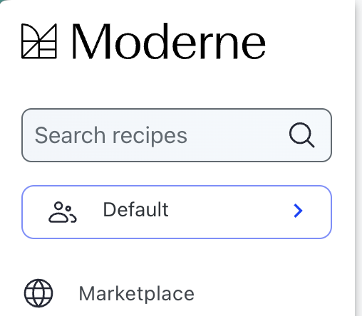
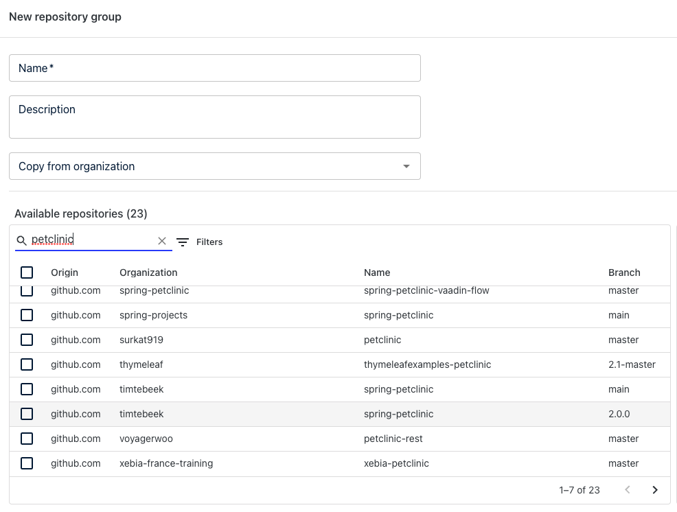
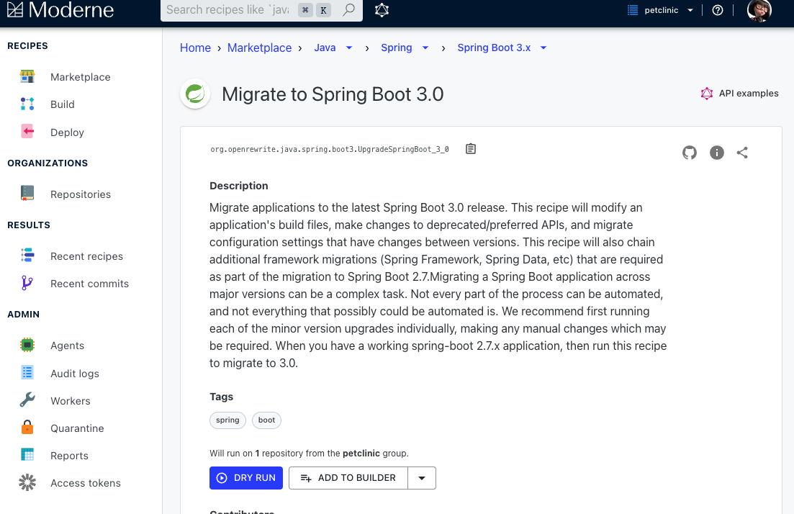
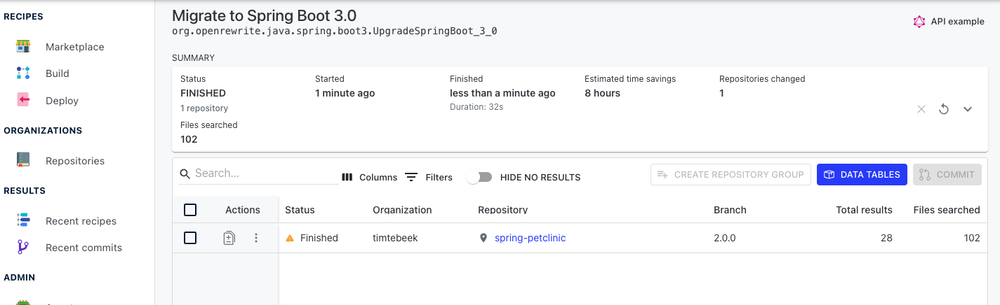

# Moderne platform exercise

In this exercise, you will utilize the [Moderne platform](https://app.moderne.io/) to:

* Migrate the [Spring PetClinic](https://github.com/spring-projects/spring-petclinic) repository from Spring Boot 2 to 3
* Fix security vulnerabilities across hundreds of open-source projects

## Prepare your environment

Go to [https://app.moderne.io/](https://app.moderne.io/) and register with your GitHub account. Once you've signed in,
you'll find more than 25,000 open-source repositories that can be used to test OpenRewrite recipes without you having to
configure anything.

## Running recipes with the Moderne platform

1. Once you're logged in to [Moderne](https://app.moderne.io/), the first thing you'll want to do is to create a
   repository group with just the Spring PetClinic repository in it. To do so, click on the `Default` group in the top
   right-hand corner of your screen and select `Create` from the menu that appears:

2. A repository group is a list of repositories that are grouped under a name that is only visible to you. You can use
   any name for the repository group. For this exercise, let's call it `petclinic`. After giving it a name, select
   `github.com/moderneinc/spring-petclinic@2.0.0` from the list of available repositories. To save this repository
   group, please press the `Save` button in the bottom right corner of your screen:

3. With the repository group created, you can go to the [Moderne Marketplace](https://app.moderne.io/marketplace). From
   there, click on `Java`, then `Spring`, then `Spring Boot 3.x`, and finally select
   [VERSION_MIGRATE_SPRING_BOOT](https://app.moderne.io/recipes/org.openrewrite.java.spring.boot3.VERSION_RECIPE_SPRING_BOOT):

4. After that, double-check that the repository group you created is selected by looking at the top right-hand corner of
   the screen. It should say `petclinic`. Likewise, above the `DRY RUN` button, you should see that the recipe will run
   against `1` repository. If you want more details about the recipe, you can click on the `More Details` link. From
   there, you can find additional information such as a link to the source code for this recipe (all of the recipes are
   OpenRewrite recipes).

5. To begin running the recipe, click on the `DRY RUN` button.

6. You will now be redirected to a page that shows all of the relevant recipe run information. Once it's finished, you
   can click on the repository name to see the results:

7. If you look at the results you should see that:

* The `@Autowired` annotation was removed
* JUnit 4 has been replaced with JUnit 5
* `javax` has been replaced with `jakarta`
* The code has been migrated to Java 17 and text blocks are used
* Some best practices are applied (such as adding the `public` test method modifier)

## Fixing security vulnerabilities with the Moderne platform

Another substantial use case for the Moderne platform is detecting and potentially resolving CVEs in your projects and
their dependencies. Since the Moderne platform supports complex refactoring recipes (such as the Spring Boot 3
migration), the community can contribute and provide recipes for other major migrations that do more than bump a
dependency version.

In this part of the exercise, let's use the Moderne platform to get a list of vulnerabilities in open-source
repositories.

1. Begin by navigating to
   the [Check for dependency vulnerabilities recipe](https://app.moderne.io/recipes/org.openrewrite.java.dependencies.DependencyVulnerabilityCheck
   ).

2. Select `compile` for the first option (`scope`), `true`, for the second option (`override managed version`), and
   leave the third option as blank (`add markers`).

3. Click on the repository group link in the top right-hand corner of the screen and select `Default` as the group to
   run on.

4. Click on the `DRY RUN` button to begin executing this recipe. It should take a few minutes to run.

5. Once the recipe is done running, you can click on the individual repositories to see suggested changes that fix some
   vulnerabilities.

6. You can also click on the `Data Tables` tab to get taken to a page that allows you to download a CSV that contains a
   list of CVEs that the repositories are vulnerable to. Download the CSV vulnerability report and open the CSV with
   your preferred CSV reader. You will see that the CSV contains an entry per vulnerability, dependency, and repository.
   Take special note of the column called `fixedVersion`. That tells you what version fixes that vulnerability. Also
   take note of the `depth` column, which lets you see how many dependencies away it is from your original dependency.

7. You can also click on the `Visualizations` tab to get a quick high over insight into the number of known
   vulnerabilities associated with dependencies in the projects.
