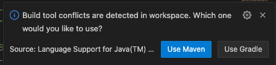
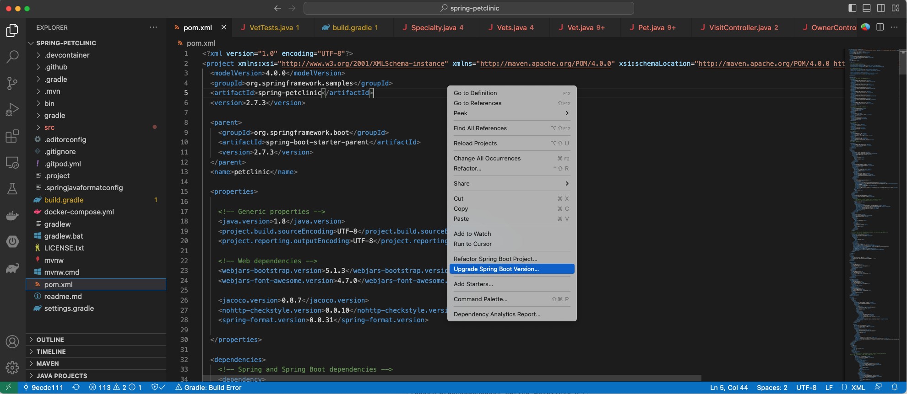
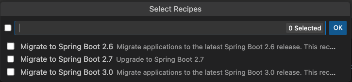

# Spring Tools Adventure

In this adventure, we are going to migrate an old version of a Spring (Maven) application to Spring Boot 3 using Visual
Studio.

## Prepare your environment

1. Install [Visual Studio Code](https://code.visualstudio.com/)

2. Install the [Spring Tools 4 plugin](https://spring.io/tools)

3. Switch to Java 8 so you can properly build this repository and restart your Visual Studio. You might need to download
   Java 8 and update your `JAVA_HOME` environment variable. If you are on a Unix-based system, we recommend
   using [SDKMan](https://sdkman.io/):

```shell
sdk install java 8.0.372-tem
sdk use java 8.0.372-tem
```

* If you aren't on a Unix-based system or you don't want to install SDKMan, you'll need to install Java 8 and run
  something like:

```shell
export JAVA_HOME=REPLACE_FOR_LOCATION_OF_JAVA_8
```

4. Clone the [Spring PetClinic repository](https://github.com/spring-projects/spring-petclinic):

```shell
git clone https://github.com/spring-projects/spring-petclinic
```

5. Check out the last Spring Boot 2.0 commit:

```shell
git checkout b527de52f5fd19f9fe550372c017d145a3b2a809
```

6. Make sure it runs on your machine:

```shell
./mvnw package -DskipTests
``` 

## Migrate to Spring Boot 3 using Spring Tools 4

Spring Tools 4 has OpenRewrite embedded into it.

Open the `spring-petclinic` repository with VS Code. You might see a pop-up in the bottom right saying that build tool
conflicts are detected. Make sure you select `Use Maven` or the next steps won't work:



Once the project builds and `Maven` is selected, you can open the `pom.xml` file and right-click anywhere in the file.
You should see two important options appear:

* Refactor Spring Boot Project
* Upgrade Spring Boot Version



For this adventure, let's click on `Upgrade Spring Boot Version`. The following dialog window should then appear:



:::note
If you don't see the above window and you get an error about `No Spring Boot` project being found, please try restarting
VS Code and select `Use Maven` in the popup that appears when VS Code loads.
:::

Select `Migrate to Spring Boot 3.0`. A progress message should appear at the bottom of VS Code. After the process
finishes, the changes won't be saved yet. You'll need to click on `File` > `Save All` to save all of the files and
preview the changes in Git:

```shell
git diff
```

:::note
This is a very recent feature that is only available for Maven projects and takes several minutes to execute. Only some
of the OpenRewrite migrations can be applied with this feature.
:::

However, if you look at the results you should see that:

* The `@Autowired` annotation was removed
* JUnit 4 has been replaced with JUnit 5
* `javax` has been replaced with `jakarta`
* The code has been migrated to Java 17 and text blocks are used
* Some best practices are applied (such as adding the `public` test method modifier)
   
