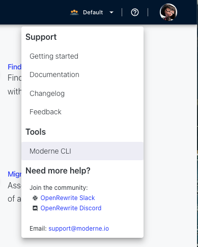

# Moderne CLI Adventure

In this adventure, you will use the [Moderne
CLI](https://docs.moderne.io/moderne-cli/cli-intro), a free tool that allows
developers to run OpenRewrite recipes without configuring any build plugin, to
migrate a repository from Spring Boot 2 to Spring Boot 3.

Afterwards, you'll use the CLI to publish your own OSS repository to the Moderne
platform so that you can run recipes on it without having to build it over and
over.

## Prepare your environment

1. Download the Moderne CLI by going to
   [https://public.moderne.io](https://public.moderne.io), clicking on the `?`
   in the top right corner, and selecting `Moderne CLI` from the menu:



2. Create a Moderne Access Token by going to
   [https://public.moderne.io/settings/access-token](https://public.moderne.io/settings/access-token).
   Once there, enter a name for the token and press `generate`.

3. Export your token as an envorinment variable

```shell
export MODERNE_ACCESS_TOKEN="mat-YOUR_TOKEN_HERE"
```

4. Switch to Java 8 so you can properly build this repository. You might need to
download Java 8 and update your `JAVA_HOME` environment variable. If you are
on a Unix-based system, we recommend using [SDKMan](https://sdkman.io/):

```shell
sdk install java 8.0.372-tem
sdk use java 8.0.372-tem
```
  * If you want to use `sdk` and the `java 8.0.372-tem` distribution 
    is not available for you, select any distribution that represents a Java 8 version.
    
  * If you aren't on a Unix-based system or you don't want to install SDKMan,
    you'll need to install Java 8 and run something like:

```shell
export JAVA_HOME=REPLACE_FOR_LOCATION_OF_JAVA_8
```

6. Clone the [Spring PetClinic
   repository](https://github.com/spring-projects/spring-petclinic):

```shell
git clone https://github.com/spring-projects/spring-petclinic
```

7. Check out the last Spring Boot 2.0 commit:

```shell
cd spring-petclinic
git checkout b527de52f5fd19f9fe550372c017d145a3b2a809
```


8. Make sure it runs on your machine:

```shell
./mvnw package -DskipTests
``` 

## Migrate to Spring Boot 3 using the Moderne CLI

1. Run the build command to generate the repository LST

```shell
mod build --path . --mvnPluginVersion=0.41.0
```

2. Now, witch to Java 17 to run recipes. This is a requirement of the CLI.

```shell
export JAVA_HOME=REPLACE_FOR_LOCATION_OF_JAVA_17
```
 
3. following command from the `spring-petclinic` repository:

```shell
mod run --path . --recipeName org.openrewrite.java.spring.boot3.UpgradeSpringBoot_3_0 --recipeGAV org.openrewrite.recipe:rewrite-spring:4.36.0 --skipBuild
```

4. The previous command should have updates your source files. You can then see the changes made by running:

```shell
git diff
```

## Run a recipe in a remote repositories

Publishing your [Lossless Semantic
Tree](https://docs.moderne.io/concepts/lossless-semantic-trees) (LST) artifacts
to the platform allows you to run multiple recipes without having to build the
repository every time (as LSTs contain all of the information needed to run a
recipe).

We have already many LST open source repositories in the platform. With the
Moderne CLI you can run an existing recipe or debug a recipe to see if it
might work in repositories that have published their LSTs.

With the following command you will run the CleanUp recipe for all the Netflix 
repositories we have in the Moderne platform. 

````shell
mod run --repositories "github.com/Netflix/.+@main" --recipeName org.openrewrite.java.cleanup.Cleanup --recipeGAV 
org.openrewrite:rewrite-java:7.38.0
```

The [CleanUp recipe](https://public.moderne.io/recipes/org.openrewrite.java.cleanup.Cleanup?) 
removes unnecessary parenthesis and simplify some expressions.

We invite you to experiment to run [any of our recipes](https://public.moderne.io/marketplace) 
in the OSS repositories we have from Netflix.  
