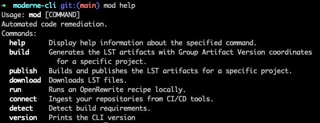

# Moderne CLI Adventure

In this adventure, you will use the [Moderne
CLI](https://docs.moderne.io/moderne-cli/cli-intro), a free tool that allows
developers to run OpenRewrite recipes without configuring any build plugin, to
migrate a repository from Spring Boot 2 to Spring Boot 3.

Afterwards, you'll use the CLI to publish your own OSS repository to the Moderne
platform so that you can run recipes on it without having to build it over and
over.

## Prepare your environment

### Download and configure the Moderne CLI

1. Go to the [Moderne platform](https://app.moderne.io) and sign in.

2. Click on the `?` in the top right corner and then select `Moderne CLI` from
   the `Tools` menu:

   

3. You can then either press the `Download Latest` button or install it directly
   through the command line by copying the `curl` command at the bottom of the
   modal:

   

4. Regardless of how you downloaded the CLI, you'll need to save it somewhere
   that your terminal can access. This could involve updating your `PATH` to
   point to a specific location or this could involve putting it in a directory
   that's already on your `PATH` such as a `/usr/bin` directory.

5. Ensure you can run the CLI by typing `mod help`. If everything is set up
   correctly, you should see a list of commands:

   

6. Before you can run any commands, you'll need to create a Moderne Access
   Token. Go to
   [https://app.moderne.io/settings/access-token](https://app.moderne.io/settings/access-token),
   enter a name for the token, and press `generate`.

7. Once created, you should see a command that you can run to install the token
   on your system. Either run that command or export your token directly as an
   environment variable:

```shell
export MODERNE_ACCESS_TOKEN="mat-YOUR_TOKEN_HERE"
```

### Configure the Spring PetClinic repository

With the CLI downloaded and configured, you're now ready to set up the
repository.

1. Clone the [Spring PetClinic
   repository](https://github.com/spring-projects/spring-petclinic):

```shell
git clone https://github.com/spring-projects/spring-petclinic
```

2. Check out the last Spring Boot 2.0 commit:

```shell
cd spring-petclinic
git checkout b527de52f5fd19f9fe550372c017d145a3b2a809
```

3. If you tried building this repository right now, you would more than likely
   run into errors. This is because this version of the Spring PetClinic repo
   requires Java 8. To ensure that everything builds correctly, you may need to
   download Java 8 and update your `JAVA_HOME` environment variable. If you are
   on a Unix-based system, we recommend using [SDKMan](https://sdkman.io/):

      ```shell
      sdk install java 8.0.372-tem
      sdk use java 8.0.372-tem
      ```

  * If you want to use `sdk` and the `java 8.0.372-tem` distribution 
    is not available for you, select any distribution that represents a Java 8 version.

  * If you aren't on a Unix-based system or you don't want to install SDKMan,
    you'll need to install Java 8 and run something like:

      ```shell
      export JAVA_HOME=REPLACE_FOR_LOCATION_OF_JAVA_8
      ```

4. With Java 8 configured, make sure that the Spring PetClinic repository builds
   on your machine:

```shell
./mvnw package -DskipTests
```

5. If everything has been set up correctly, you should see a `BUILD SUCCESS`
   message after the project is built and the tests passed.

## Migrate to Spring Boot 3 using the Moderne CLI

Now that the repository is configured, it's time to migrate it to Spring Boot 3
using the Moderne CLI.

1. Run the build command to generate the LST for the PetClinic repo:

```shell
mod build --path . --mvnPluginVersion=1.2.1
```

2. Next, switch to Java 17 to run recipes. This is a requirement of the CLI:

```shell
sdk install java 17.0.7-tem
sdk use java 17.0.7-tem
```

OR

```shell
export JAVA_HOME=REPLACE_FOR_LOCATION_OF_JAVA_17
```
 
3. Kick off the recipe by running the following command from the
   `spring-petclinic` repository:

```shell
mod run --path . --recipeName org.openrewrite.java.spring.boot3.UpgradeSpringBoot_3_0 --recipeGAVs org.openrewrite.recipe:rewrite-spring:5.0.2 --skipBuild
```

4. The previous command should have updated your source files. Whenever you run
   a recipe, you should always double-check that the changes made match your
   expectations by running:

```shell
git diff
```

## Run a recipe on a remote LST

Publishing your [Lossless Semantic
Tree](https://docs.moderne.io/concepts/lossless-semantic-trees) (LST) artifacts
to the platform allows you to run multiple recipes without having to build the
repository every time (as LSTs contain all of the information needed to run a
recipe).

We have already many LST open-source repositories in the platform. With the
Moderne CLI, you can run an existing recipe or debug a recipe to see if it
might work in repositories that have published their LSTs.

With the following command, you will run the CleanUp recipe for all the Netflix 
repositories we have in the Moderne platform:

```shell
mod run --repositories "github.com/Netflix/.+@main" --recipeName org.openrewrite.staticanalysis.CodeCleanup --recipeGAVs org.openrewrite.recipe:rewrite-static-analysis:1.0.2
```

The [CleanUp recipe](https://app.moderne.io/recipes/org.openrewrite.staticanalysis.CodeCleanup?) 
removes unnecessary parenthesis and simplifies some expressions.

We invite you to experiment to run [any of our recipes](https://app.moderne.io/marketplace) 
in the OSS repositories we have from Netflix.  
