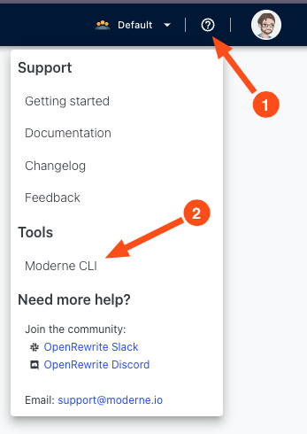

# Moderne CLI Adventure

In this session we are going to use a free Moderne CLI that allows to 
run OpenRewrite recipes without requiring to configure any build plugins
and therefore support other programming languages and build tools that 
are not for Java developers. In this adventure, we suggest two exercises:

- Migrate to Spring Boot 3 using the CLI.
- Publish a new OSS repository into the Moderne Platform. 

## Prepare your environment

1. Download the CLI. To do so, download the CLI from `https://public.moderne.io`



2. Create a Moderne Access Token from `https://public.moderne.io/settings/access-token`
and store it in your local file system.

```
echo "YOUR_ACCESS_TOKEN" > $HOME/.moderne/token.txt
```

3. Clone the repository `https://github.com/spring-projects/spring-petclinic`

```
git clone https://github.com/spring-projects/spring-petclinic
```

4. Checkout the last commit in Spring Boot 2.0
   
```
cd spring-petclinic
git checkout 9ecdc1111e3da388a750ace41a125287d9620534
```
5. Test you can build it

```
./gradlew build -x test
```

## Migrate to Spring Boot 3 using the Moderne CLI

1. Run the following command from the `spring-petclinic` repository

```
mod run --path . --recipeName org.openrewrite.java.spring.boot3.UpgradeSpringBoot_3_0 --recipeGAV org.openrewrite.recipe:rewrite-spring:4.36.0
```

2. Apply the patch

The previous command should have printed a patch file in the standard output. To properly see the changes, let's apply them.

```
git apply REPLACE_FOR_PATCH_FILE 
```

3. and then, see the changes with:

```
git diff
```

## Publish your OSS repositories to the Moderne platform

Publishing LSTs into the platform allows to run multiple recipes without having to build the repository every single time. LSTs have 
all the information required to run a recipe and therefore, it is not necessary to compile the source code. 


1. In this case, we suggest you to publish multiple OSS repositories of your personal GitHub account or organization to really see the benefit 
of running OpenRewrite at scale. 

```
git clone REPLACE_WITH_MY_REPO_URL
mod publish --path REPLACE_WITH_PATH_TO_MY_REPO
```

2. Now, after 2 minutes or so, you should be able to see it in the [Moderne Platform](https://public.moderne.io/). To check if the 
repository has been added, go to https://public.moderne.io/organizations and search your repository name.

3. In case you want to run a recipe to your repository from the platform, we recommend to continue with the [Moderne Platform 
Adventure](https://github.com/moderneinc/springboot-migration-workshop/tree/main/moderne-platform-adventure).
