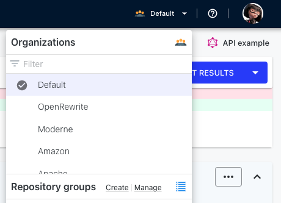
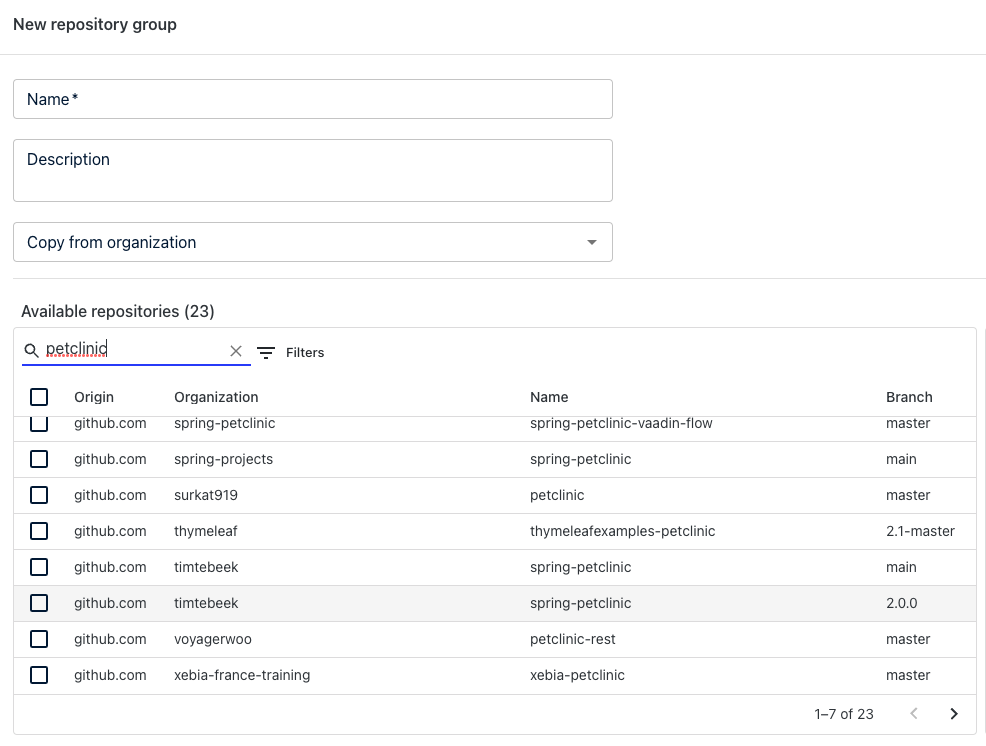
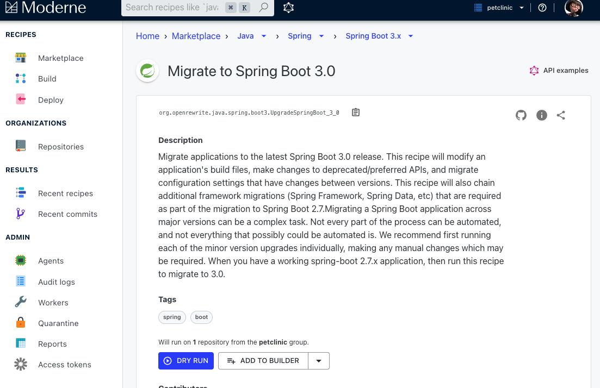

# Moderne Platform Adventure

In this adventure, there are two challeges:

- The first one, which is all about migrating the spring-petclinic project from a UI 
like we have completed in the other exercises. 

- The second one is about fixing all the security vulnerabilities across hundreds of projects.

## Prepare environment

Visit https://public.moderne.io/ and register yourself with your GitHub account. Moderne has more than 30k open source repositories loaded that can be used to test the OpenRewrite recipes without having to configure 
anything in your build system. If you are interested to see how you can publish a new open source repository, we recommend to also play
with  the Moderne CLI adventure.

## Spring Boot Migration

1. Now, we are going to create a repository group with one repository that contains the
Spring Petclinic content when it was using a 2.x Spring Boot version. To do so,
click on the `Create` option of the `Repository Groups` section.

2. A repository group is a list of repositories that are grouped under a name that it is
only visible for your user. You can use any name for the repository group. We are going
to call it `petclinic`. After giving a name, you need to select the repository 
`github.com/timtebeek/spring-petclinic@2.0.0`. Then click on the `Save` option.   

3. Now, you can go back, and in the `Marketplace` menu, you can click on `Java` and 
then `Spring`, and finally select `Spring Boot 3.x`.

 

4. After that, check again that in the top menu, your new repository group is selected 
(in our case `petclinic`)and the`DRY RUN` option says that there is 1 single repository.
Notice that there is a GitHub icon on the right side, which enables you to find the 
source code of the recipe, which are always open source. They are all OpenRewrite 
recipes.

5. Click on `DRY RUN`.

6. Then you will see a recipe running, and when it is completed, you can click on the repository
name to see the results. 

- It is important to see that the results contain:

  - The removal of `@Autowired`.
  - The replacement of Junit 4 for JUnit 5.
  - The replacement of `javax` for `jakarta`.
  - It is migrated to Java 17 and uses text blocks.
  - Some best practices are applied such as test modifiers are removed.
 

## Security Vulnerabilities

Another use case to use the platform is for detecting CVEs in the dependencies
and upgrade a set of repositories with the last versions. Since the Moderne platform
supports complex refactorings such as the SpringBoot 3 migration, it is expected
that the community can contribute and provide recipe for other major migrations that
not only require to bump the dependency version. In this challenge, we are going to see
how we can see the list of vulnerabilities in important open source repositories and
create a composite refactor with many the minor vulnerabilities that we want to fix.

1. In this case, we are going to use the `Check for dependency vulnerabilities` recipe.
This recipe offers three options. For demo purposes, we recommend to simply 
select:

    - Scope:  `compile`. 
    - Overwrite management version: true.
    - Add markers: No value selected.

2. In the top menu, select the default repository group, which is composed by a hundred (142) of
open source Netflix and Spring repositories.

3. Select `DRY RUN`, this should take 10 minutes approx. Now, clicking on each of the repositories, 
you should be able to see what dependency changes are required to remove vulnerabilities, in 
case dependencies can be locally fixed.

4. Click on data tables (right side blue button) and download the vulnerability report in CSV format.

5. Open the CSV with Google spreadsheets or your preferred tool.You will see that the CSV contains
an entry per vulnerability, depedency and repository. There is an interesting column called
`fixedVersion`, which tells you what is the immediate version that fixes the vulnerability. It
is also important to notice that there is a `depth` column because we also analyze transitive
dependencies.

   
## Misk

- [Moderne Platform documentation](https://docs.moderne.io/)

