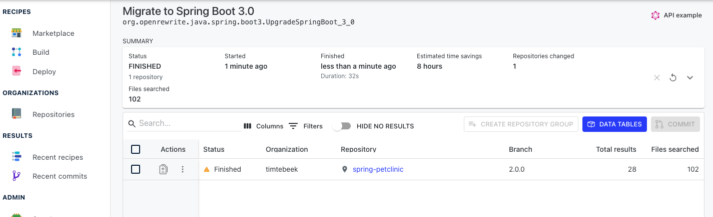

#moderne platform adventure

In this adventure, there are two challeges:

The first one, which is all about migrating the spring-petclinic project from a UI 
like we have completed in the other exercises. The second one is about reporting the
list of CVEs and composing a refactor across multiple repositories with dependency changes.

## Prepare environment

- Visit https://public.moderne.io/ and register yourself with your GitHub account.

- Moderne has more than 30k open source repositories loaded that can be used to test the OpenRewrite recipes without having to configure 
anything in your build system. If you are interested to see how you can publish a new open source repository, we recommend to also play
with  the Moderne CLI adventure.

## Spring Boot Migration

- Now, we are going to create a repository group with one repository that contains the
Spring Petclinic content when it was using a 2.x Spring Boot version. To do so,
click on the `Create` option of the `Repository Groups` section.

- A repository group is a list of repositories that are grouped under a name that it is
only visible for your user. You can use any name for the repository group. We are going
to call it `petclinic`. After giving a name, you need to select the repository 
`github.com/timtebeek/spring-petclinic@2.0.0`. Then click on the `Save` option.   

- Now, you can go back, and in the `Marketplace` menu, you can click on `Java` and 
then `Spring`, and finally select `Spring Boot 3.x`.

 

- Now, check again that in the top menu, your new repository group is selected 
(in our case `petclinic`)and the`DRY RUN` option says that there is 1 single repository.
Notice that there is a GitHub icon on the right side, which enables you to find the 
source code of the recipe, which are always open source. They are all OpenRewrite 
recipes.

- Click on `DRY RUN`

- Then you will see a recipe running, and when it is completed, you can click on the repository
name to see the results. 

- It is important to see that the results contain:

  - The removal of `@Autowired`
  - The replacement of Junit 4 for JUnit 5
  - The replacement of `javax` for `jakarta`
  - It is migrated to Java 17 and uses text blocks.
  - Some best practices are applied such as test modifiers are removed
 

## Security Vulnerabilities

