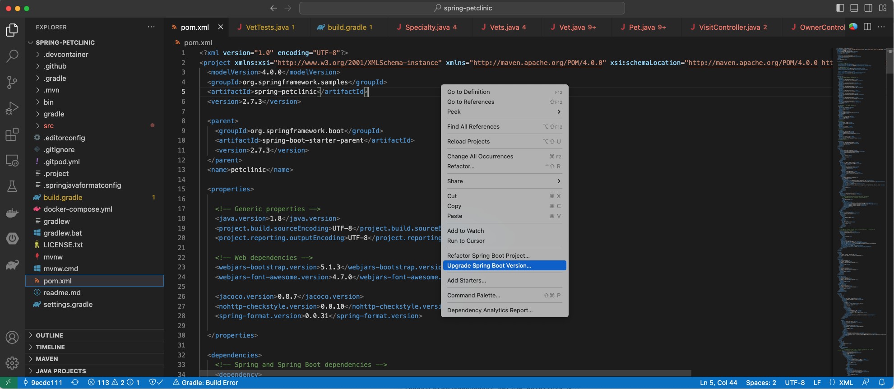
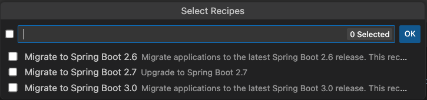

# Spring Tools Adventure

In this adventure, we are going to migrate an old version
of a Spring (Maven) application to Spring Boot 3 using 
Visual Studio.

## Prepare your environment

1. Install [Visual Studio Code](https://code.visualstudio.com/)

2. Install the [Spring Tools 4 plugin](https://spring.io/tools)

3. Clone the [Spring PetClinic
   repository](https://github.com/spring-projects/spring-petclinic):

```shell
git clone https://github.com/spring-projects/spring-petclinic
```

4. Check out the last Spring Boot 2.0 commit:

```shell
git checkout 9ecdc1111e3da388a750ace41a125287d9620534
```

## Migrate to Spring Boot 3 using Spring Tools 4 

Spring Tools 4 has OpenRewrite embedded into it. From VS Code, you can open the
`pom.xml` file and right-click anywhere in the file. You should see two
important options appear:

* Refactor Spring Boot Project
* Upgrade Spring Boot Version



For this adventure, let's click on `Upgrade Spring Boot Version`. The following
dialog window should then appear: 



Select `Migrate to Spring Boot 3.0`. A progress message should appear at the
bottom of VS Code. After the process finishes, the changes won't be saved yet.
You'll need to click on `File` > `Save All` to save all of the files and preview
the changes in Git:

```shell
git diff
```

**Note:** This is a very recent feature that is only available for Maven
projects. Only some of the OpenRewrite migrations can be applied with this
feature.
